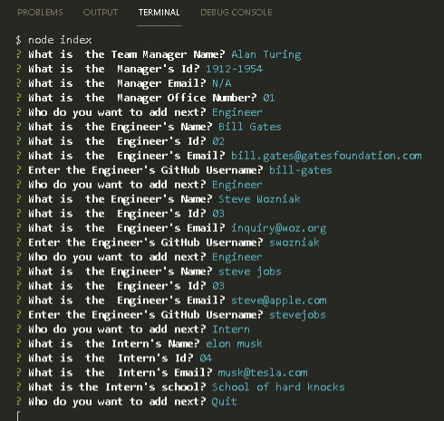
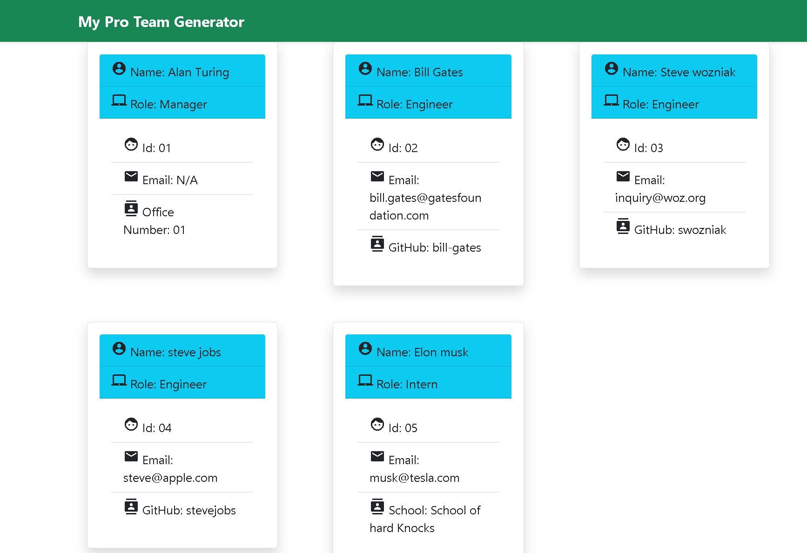

## Team Profile Generator

<br />

 <br />

## Table of Contents 

- [Description](#description)
- [Installation](#installation)
- [Usage](#usage)
- [Screenshots](#screenshots)
- [Demos](#demos)
- [Deployed](#deployedapplicationlink)
- [Languages](#languages)
- [License](#license)
- [Tests](#tests)
- [Questions](#questions)

<br />
<br />

## Description

This is my Node.js command-line application that takes in information about employees on a software engineering team and generates an HTML webpage that displays summaries for each worker. <br />

## Installation
To install all the dependencies, use the command below:
```
npm i
```
<br />

## Usage

As a manager of a team, you would enjoy using this application to generate a webpage that displays your team's basic information so that you can quickly access their emails and GitHub profiles <br />

To use this application, clone the repository to your local machine:
```
git clone git@github.com:Tonycodesnow/Team-Pro-Gen.git
```

Then, ensure you install the dependencies with command:
```
npm i
```
When you're ready to run the application, from the root folder, type the below into your command line:
```
node index
```

Once the application runs, it will generate an index.html file in the "dist" folder. If you already have an index.html file in that folder, it will first prompt you to overwrite it or not.

## Screenshots

What the tests passing looks like:

<p align="center"></p>  <br /> 

What the command line interface looks like:

<p align="center"></p> <br /> 

What the index.html file looks like once complete:

<p align="center"></p> <br /> 

## Demos

Click on the link below for a video demonstration of the application and the generated index.html file at the end:

https://www.youtube.com/watch?v=2_dT2A-LKOg

Click on the link below for a video demonstration of the tests passing:

https://youtu.be/2AAz_gekMRY

## Deployed application link

https://github.com/Tonycodesnow/Team-Pro-Gen  <br />

## Languages

JavaScript, Bootstrap, Google Fonts, Material Icons, HTML, CSS, Node, Inquirer, Jest <br />


## License

This project is licensed under the MIT license. <br />
  
## Tests

To run the tests for this application, enter the following command from the root directory:

```
npm run test
```
<br />

## Questions?

If you have any questions, contact me at: 
tony.huertinez@gmail.com  <br />
Check out my other work at GitHUb:
[antoniohuerta](https://github.com/Tonycodesnow) <br />
